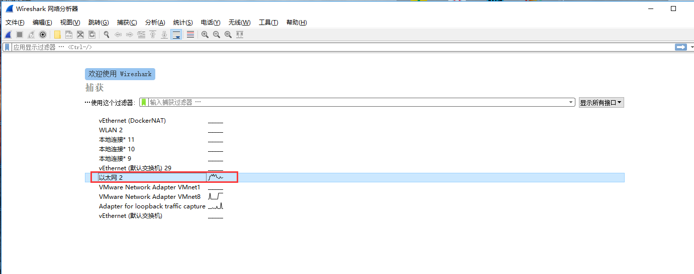
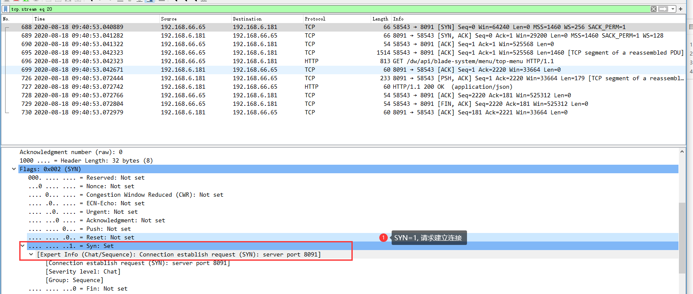

## TCP

[TOC]

### 1、前言

我们这里使用WireShark进行抓包分析；

WireShark是一个网络抓包分析软件。主要是截取网络封包，并尽可能显示出最为详细的网络封包资料。WireShark抓包是根据TCP/IP五层协议来的，也就是物理层、数据链路层、网络层、传输层、应用层。我们主要关注传输层和应用层。

### 2、TCP三次握手

TCP建立连接时，会有三次握手过程。下图是WireShark截获到的三次握手的三个数据包（虽然叫数据包，但是三次握手包是没有数据的）

**SYN**：**同步比特**，建立连接。
**ACK**：**确认比特**，置1表示这是一个确认的TCP包，0则不是。
**PSH**：**推送比特**，当发送端PSH=1时，接收端应尽快交付给应用进程

> 第一次握手
>
> SYN=1 客户端（192.168.66.65），发包到服务端（192.168.6.***）
>
>  请求建立连接

> 第二次握手
>
> 服务端收到客户端发的TCP报文之后，通过SYN=1得知客户端请求建立连接，将ACK（确认序列号）设置为客户端的序列号加1，并向客户端发起一个ACK=1，SYN=1的报文，进行确认是否要建立连接。

> 第三次握手
>
> 

