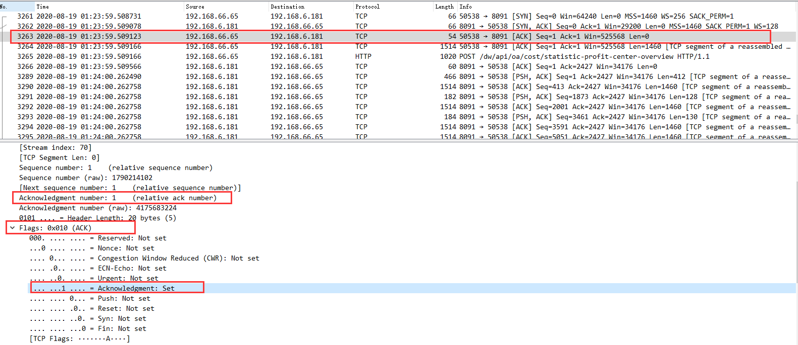
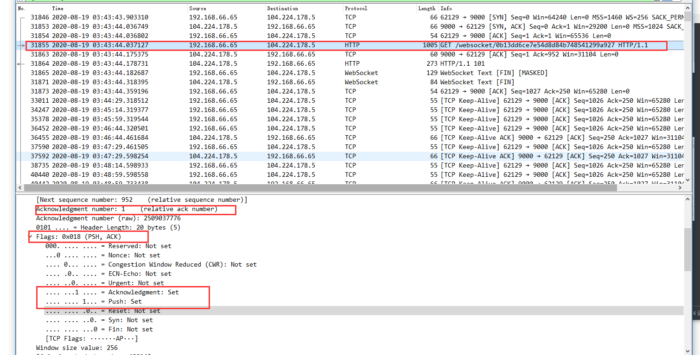
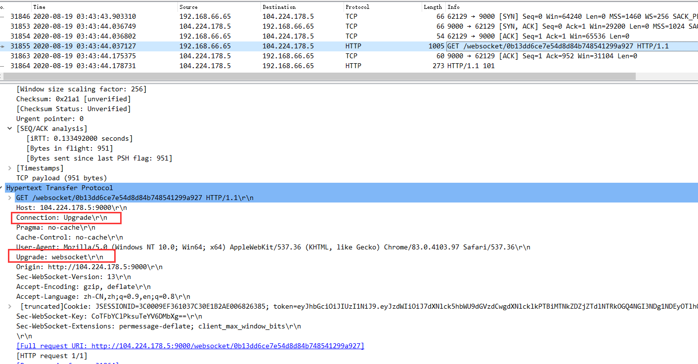
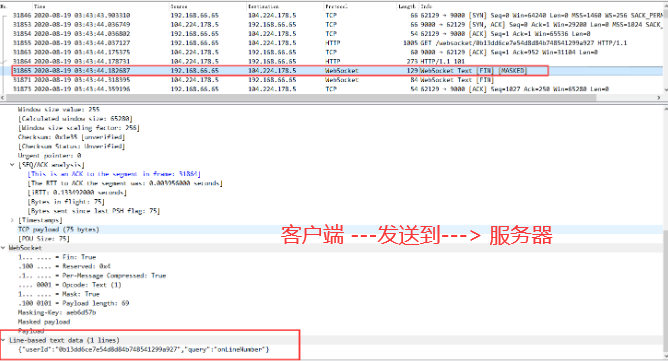
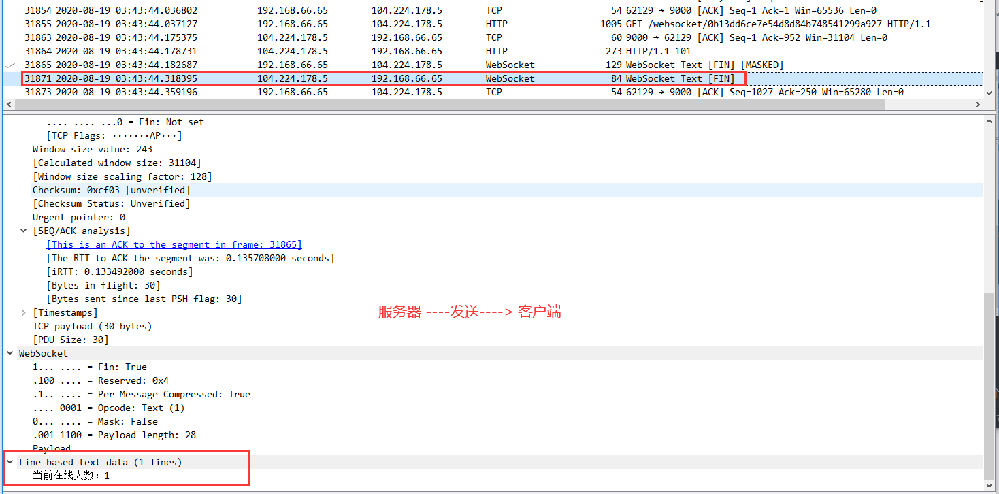

## websocket

[TOC]

### 1、前言

我们这里使用WireShark进行抓包分析；

WireShark是一个网络抓包分析软件。主要是截取网络封包，并尽可能显示出最为详细的网络封包资料。WireShark抓包是根据TCP/IP五层协议来的，也就是物理层、数据链路层、网络层、传输层、应用层。我们主要关注传输层和应用层。

### 2、TCP三次握手

TCP建立连接时，会有三次握手过程。下图是WireShark截获到的三次握手的三个数据包（虽然叫数据包，但是三次握手包是没有数据的）

**SYN**：**同步比特**，建立连接;
**ACK**：**确认比特**，置1表示这是一个确认的TCP包，0则不是;
**PSH**：**推送比特**，当发送端PSH=1时，接收端应尽快交付给应用进程;

> 刚开始客户端和服务端都处于Closed状态，此时客户端向服务端发起主动连接：

> 第一次握手
>
> SYN=1 客户端（192.168.66.65），发包到服务端（192.168.6.***）
>
>  请求建立连接。

> 第二次握手
>
> 服务端收到客户端发的TCP报文之后，通过SYN=1得知客户端请求建立连接，将ACK（确认序列号）设置为客户端的序列号seq加1，并向客户端发起一个ACK=1，SYN=1的报文，进行确认是否要建立连接。

> 第三次握手
>
> 客户端接收到服务器发过来的包后检查确认序列号是否正确，即第一次发送的序号+1，以及标志位ACK是否为1。若正确则再次发送确认包，ACK标志为1。链接建立成功，可以发送数据了

接下应该是HTTP请求了，不过发现这里有个TCP segment of a reassembled PDU，查阅相关资料是因为报文长度超过了能够传输的最大数据分段为**MSS**（Maximum Segment Size），所以进行了分段传输。

> HTTP 请求
>
> 传输层（Tcp）: PSH（推送比特）置1，ACK置1，PSH置1说明开始发送数据，同时发送数据ACK要置1，因为需要接收到这个数据包的端给予确认。PSH为1的情况，一般只出现在 DATA内容不为0的包中，也就是说PSH为1表示的是有真正的TCP数据包内容被传递

> TCP的6种标志位的分别代表：
>
> SYN(synchronous建立联机)
>
> ACK(acknowledgement 确认)
>
> PSH(push传送)
>
> FIN(finish结束)
>
> RST(reset重置)
>
> URG(urgent紧急)
>
> Sequence number(顺序号码)
>
> Acknowledge number(确认号码)

`下面时序图中，SYN指的的是SYN(synchronous建立联机)、ACK指的是ACK(acknowledgement 确认)，ack指的是Acknowledge number(确认号码)，seq指的是Sequence number(顺序号码)`

~~~sequence
Title: TCP三次握手
Note left of 客户端: 主动打开
Note right of 服务端: 被动打开进入LISTEN状态
Note over 客户端,服务端: SYN
客户端-->服务端: 发起请求，SYN=1,seq=x(客户端序列号)
Note left of 客户端: 客户端进入SYN_SENT状态
Note right of 服务端: 服务端被动打开进入LISTEN状态
Note over 客户端,服务端: SYN+ACK
服务端-->客户端: 同意连接，确认ACK=1,SYN=1,ack=x+1,seq=y(服务端序列号)
Note right of 服务端: 服务端进入SYN-RCVD(同步收到)状态
Note over 客户端,服务端: ACK
客户端-->服务端: 收到确认后,ACK=1,ack=y+1,seq=x+1
Note over 客户端,服务端: 连接建立
Note left of 客户端: 客户端进入ESTABLISHED状态
Note right of 服务端: 服务端进入ESTABLISHED状态
Note over 客户端,服务端: 传输数据
~~~

刚开始, 客户端和服务器都处于 CLOSE 状态.
此时, 客户端向服务器主动发出连接请求, 服务器被动接受连接请求.

1, TCP服务器进程先创建传输控制块TCB, 时刻准备接受客户端进程的连接请求, 此时服务器就进入了 LISTEN（监听）状态

2, TCP客户端进程也是先创建传输控制块TCB, 然后向服务器发出连接请求报文，此时报文首部中的同步标志位SYN=1, 同时选择一个初始序列号 seq = x, 此时，TCP客户端进程进入了 SYN-SENT（同步已发送状态）状态。TCP规定, SYN报文段（SYN=1的报文段）不能携带数据，但需要消耗掉一个序号。

3, TCP服务器收到请求报文后, 如果同意连接, 则发出确认报文。确认报文中的 ACK=1, SYN=1, 确认序号是 x+1, 同时也要为自己初始化一个序列号 seq = y, 此时, TCP服务器进程进入了SYN-RCVD（同步收到）状态。这个报文也不能携带数据, 但是同样要消耗一个序号。

4, TCP客户端进程收到确认后还, 要向服务器给出确认。确认报文的ACK=1，确认序号是 y+1，自己的序列号是 x+1.

5, 此时，TCP连接建立，客户端进入ESTABLISHED（已建立连接）状态。当服务器收到客户端的确认后也进入ESTABLISHED状态，此后双方就可以开始通信了。

> 为什么不用两次?

- 主要是为了防止已经失效的连接请求报文突然又传送到了服务器，从而产生错误。如果使用的是两次握手建立连接，假设有这样一种场景，客户端发送的第一个请求连接并且没有丢失，只是因为在网络中滞留的时间太长了，由于TCP的客户端迟迟没有收到确认报文，以为服务器没有收到，此时重新向服务器发送这条报文，此后客户端和服务器经过两次握手完成连接，传输数据，然后关闭连接。此时之前滞留的那一次请求连接，因为网络通畅了, 到达了服务器，这个报文本该是失效的，但是，两次握手的机制将会让客户端和服务器再次建立连接，这将导致不必要的错误和资源的费。
  如果采用的是三次握手，就算是那一次失效的报文传送过来了，服务端接受到了那条失效报文并且回复了确认报文，但是客户端不会再次发出确认。由于服务器收不到确认，就知道客户端并没有请求连接。

> 为什么不用四次?

- 因为三次已经可以满足需要了, 四次就多余了.

### 3、TCP四次挥手

数据传输完毕后，没有后续数据请求后，双方就会释放连接。

~~~sequence
Title: TCP四次挥手
Note over 客户端,服务端: 传输数据
Note left of 客户端: 处于ESTABLISHED状态
Note right of 服务端: 处于ESTABLISHED状态
Note over 客户端,服务端: 客户端关闭连接
Note left of 客户端: 主动断开
Note right of 服务端: 被动断开
Note over 客户端,服务端: SYN
客户端-->服务端: 发起请求，SYN=1,seq=x(客户端序列号)
Note left of 客户端: 客户端进入SYN_SENT状态
Note right of 服务端: 服务端被动打开进入LISTEN状态
Note over 客户端,服务端: SYN+ACK
服务端-->客户端: 同意连接，确认ACK=1,SYN=1,ack=x+1,seq=y(服务端序列号)
Note right of 服务端: 服务端进入SYN-RCVD(同步收到)状态
Note over 客户端,服务端: ACK
客户端-->服务端: 收到确认后,ACK=1,ack=y+1,seq=x+1
Note over 客户端,服务端: 连接建立
Note left of 客户端: 客户端进入ESTABLISHED状态
Note right of 服务端: 服务端进入ESTABLISHED状态

~~~

### 4、 websocket

> 我们发起一个websocket连接请求

发现依然存在三次握手，之后有一个HTTP请求

这次的HTTP请求，不同于之前的请求。

Http请求头中`Connection:Upgrade ``Upgrade:websocket``,

`Upgrade`代表升级到较新的Http协议或者切换到不同的协议；

`WebSocket`使用此机制以兼容的方式与HTTP服务器建立连接。WebSocket协议有两个部分：握手建立升级后的连接，然后进行实际的数据传输。首先，客户端通过使用Upgrade: WebSocket和Connection: Upgrade头部以及一些特定于协议的头来请求WebSocket连接，以建立正在使用的版本并设置握手。服务器，如果它支持协议，回复与相同Upgrade: WebSocket和Connection: Upgrade标题，并完成握手。握手完成后，数据传输开始

如图所示，Websocket协议本质上是一个基于TCP的协议。建立连接需要握手，客户端（浏览器）首先向服务器（web server）发起一条特殊的http请求，web server解析后生成应答到浏览器，这样子一个websocket连接就建立了，直到某一方关闭连接。

### 

