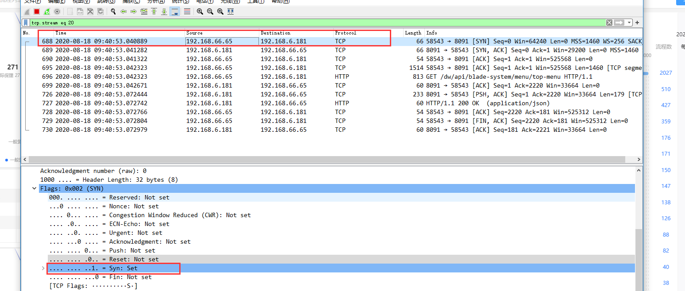
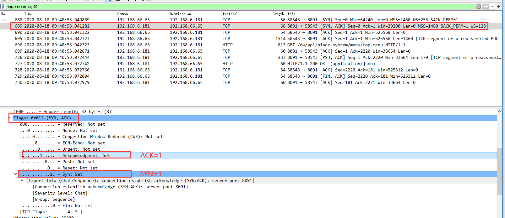
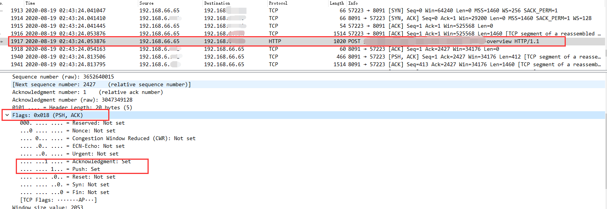
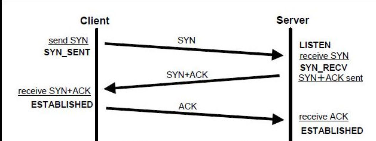
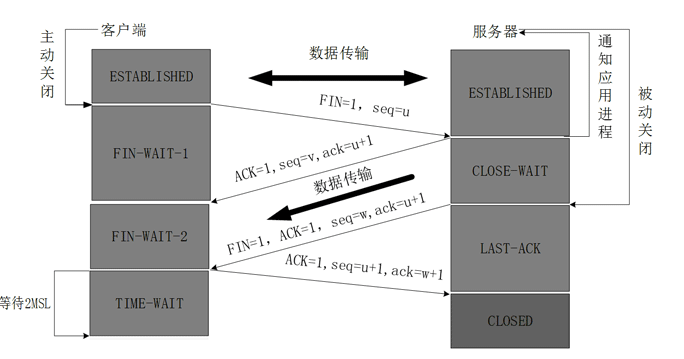
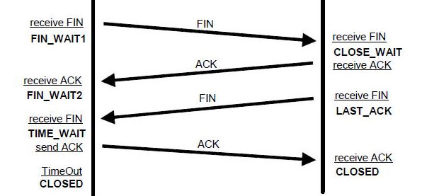

## websocket

[TOC]

### 1、前言

我们这里使用WireShark进行抓包分析；

WireShark是一个网络抓包分析软件。主要是截取网络封包，并尽可能显示出最为详细的网络封包资料。WireShark抓包是根据TCP/IP五层协议来的，也就是物理层、数据链路层、网络层、传输层、应用层。我们主要关注传输层和应用层。

### 2、TCP三次握手

TCP建立连接时，会有三次握手过程。下图是WireShark截获到的三次握手的三个数据包（虽然叫数据包，但是三次握手包是没有数据的）

**SYN**：**同步比特**，建立连接;
**ACK**：**确认比特**，置1表示这是一个确认的TCP包，0则不是;
**PSH**：**推送比特**，当发送端PSH=1时，接收端应尽快交付给应用进程;

> 刚开始客户端和服务端都处于Closed状态，此时客户端向服务端发起主动连接：

> 第一次握手
>
> SYN=1 客户端（192.168.66.65），发包到服务端（192.168.6.***）
>
>  请求建立连接。

> 第二次握手
>
> 服务端收到客户端发的TCP报文之后，通过SYN=1得知客户端请求建立连接，将ACK（确认序列号）设置为客户端的序列号seq加1，并向客户端发起一个ACK=1，SYN=1的报文，进行确认是否要建立连接。

> 第三次握手
>
> 客户端接收到服务器发过来的包后检查确认序列号是否正确，即第一次发送的序号+1，以及标志位ACK是否为1。若正确则再次发送确认包，ACK标志为1。链接建立成功，可以发送数据了

接下应该是HTTP请求了，不过发现这里有个TCP segment of a reassembled PDU，查阅相关资料是因为报文长度超过了能够传输的最大数据分段为**MSS**（Maximum Segment Size），所以进行了分段传输。

> HTTP 请求
>
> 传输层（Tcp）: PSH（推送比特）置1，ACK置1，PSH置1说明开始发送数据，同时发送数据ACK要置1，因为需要接收到这个数据包的端给予确认。PSH为1的情况，一般只出现在 DATA内容不为0的包中，也就是说PSH为1表示的是有真正的TCP数据包内容被传递

> TCP的6种标志位的分别代表：
>
> SYN(synchronous建立联机)
>
> ACK(acknowledgement 确认)
>
> PSH(push传送)
>
> FIN(finish结束)
>
> RST(reset重置)
>
> URG(urgent紧急)
>
> Sequence number(顺序号码)
>
> Acknowledge number(确认号码)

`下面时序图中，SYN指的的是SYN(synchronous建立联机)、ACK指的是ACK(acknowledgement 确认)，ack指的是Acknowledge number(确认号码)，seq指的是Sequence number(顺序号码)`

~~~sequence
Title: TCP三次握手
Note left of 客户端: 主动打开
Note right of 服务端: 被动打开进入LISTEN状态
Note over 客户端,服务端: SYN
客户端-->服务端: 发起请求，SYN=1,seq=x(客户端序列号)
Note left of 客户端: 客户端进入SYN_SENT状态
Note right of 服务端: 服务端被动打开进入LISTEN状态
Note over 客户端,服务端: SYN+ACK
服务端-->客户端: 同意连接，确认ACK=1,SYN=1,ack=x+1,seq=y(服务端序列号)
Note right of 服务端: 服务端进入SYN-RCVD(同步收到)状态
Note over 客户端,服务端: ACK
客户端-->服务端: 收到确认后,ACK=1,ack=y+1,seq=x+1
Note over 客户端,服务端: 连接建立
Note left of 客户端: 客户端进入ESTABLISHED状态
Note right of 服务端: 服务端进入ESTABLISHED状态
Note over 客户端,服务端: 传输数据
~~~

刚开始, 客户端和服务器都处于 CLOSE 状态.
此时, 客户端向服务器主动发出连接请求, 服务器被动接受连接请求.

1, TCP服务器进程先创建传输控制块TCB, 时刻准备接受客户端进程的连接请求, 此时服务器就进入了 LISTEN（监听）状态

2, TCP客户端进程也是先创建传输控制块TCB, 然后向服务器发出连接请求报文，此时报文首部中的同步标志位SYN=1, 同时选择一个初始序列号 seq = x, 此时，TCP客户端进程进入了 SYN-SENT（同步已发送状态）状态。TCP规定, SYN报文段（SYN=1的报文段）不能携带数据，但需要消耗掉一个序号。

3, TCP服务器收到请求报文后, 如果同意连接, 则发出确认报文。确认报文中的 ACK=1, SYN=1, 确认序号是 x+1, 同时也要为自己初始化一个序列号 seq = y, 此时, TCP服务器进程进入了SYN-RCVD（同步收到）状态。这个报文也不能携带数据, 但是同样要消耗一个序号。

4, TCP客户端进程收到确认后还, 要向服务器给出确认。确认报文的ACK=1，确认序号是 y+1，自己的序列号是 x+1.

5, 此时，TCP连接建立，客户端进入ESTABLISHED（已建立连接）状态。当服务器收到客户端的确认后也进入ESTABLISHED状态，此后双方就可以开始通信了。

> 为什么不用两次?

- 主要是为了防止已经失效的连接请求报文突然又传送到了服务器，从而产生错误。如果使用的是两次握手建立连接，假设有这样一种场景，客户端发送的第一个请求连接并且没有丢失，只是因为在网络中滞留的时间太长了，由于TCP的客户端迟迟没有收到确认报文，以为服务器没有收到，此时重新向服务器发送这条报文，此后客户端和服务器经过两次握手完成连接，传输数据，然后关闭连接。此时之前滞留的那一次请求连接，因为网络通畅了, 到达了服务器，这个报文本该是失效的，但是，两次握手的机制将会让客户端和服务器再次建立连接，这将导致不必要的错误和资源的费。
  如果采用的是三次握手，就算是那一次失效的报文传送过来了，服务端接受到了那条失效报文并且回复了确认报文，但是客户端不会再次发出确认。由于服务器收不到确认，就知道客户端并没有请求连接。

> 为什么不用四次?

- 因为三次已经可以满足需要了, 四次就多余了.

### 3、TCP四次挥手

数据传输完毕后，没有后续数据请求后，双方就会释放连接。

~~~sequence
Title: TCP四次挥手
Note over 客户端,服务端: 传输数据
Note left of 客户端: 处于ESTABLISHED状态
Note right of 服务端: 处于ESTABLISHED状态
Note over 客户端,服务端: 客户端关闭连接
Note left of 客户端: 主动断开
Note right of 服务端: 被动断开

Note over 客户端,服务端: FIN
客户端-->服务端: 发起请求，FIN=1,seq=u(客户端序列号)
Note left of 客户端: 客户端进入FIN-WAIT-1状态

Note over 客户端,服务端: ACK
服务端-->客户端: 确认断开,ACK=1,ack=u+1,seq=v(服务端序列号)
Note right of 服务端: 服务端被动进入CLOSE-WAIT状态
Note left of 客户端: 客户端进入FIN-WAIT-2状态

Note over 客户端,服务端: 传输数据
Note over 客户端,服务端: FIN
服务端-->客户端: 发送数据完毕后确认断开,FIN=1, ACK=1,ack=u+1,seq=w(服务端序列号)
Note right of 服务端: 服务端进入LAST-ACK（最后确认）

Note over 客户端,服务端: ACK
客户端-->服务端: 收到释放报文后后,ACK=1,ack=w+1,seq=u+1
Note left of 客户端: 客户端进入TIME-WAIT状态
Note over 客户端,服务端: 连接释放成功
Note right of 服务端: 服务端进入ClOSED状态

~~~

数据传输完毕后，双方都可以释放连接.
此时客户端和服务器都是处于ESTABLISHED状态，然后客户端主动断开连接，服务器被动断开连接.

1, 客户端进程发出连接释放报文，并且停止发送数据。
释放数据报文首部，FIN=1，其序列号为seq=u（等于前面已经传送过来的数据的最后一个字节的序号加1），此时客户端进入FIN-WAIT-1（终止等待1）状态。 TCP规定，FIN报文段即使不携带数据，也要消耗一个序号。

2, 服务器收到连接释放报文，发出确认报文，ACK=1，确认序号为 u+1，并且带上自己的序列号seq=v，此时服务端就进入了CLOSE-WAIT（关闭等待）状态。
TCP服务器通知高层的应用进程，客户端向服务器的方向就释放了，这时候处于半关闭状态，即客户端已经没有数据要发送了，但是服务器若发送数据，客户端依然要接受。这个状态还要持续一段时间，也就是整个CLOSE-WAIT状态持续的时间。

3, 客户端收到服务器的确认请求后，此时客户端就进入FIN-WAIT-2（终止等待2）状态，等待服务器发送连接释放报文（在这之前还需要接受服务器发送的最终数据）

4, 服务器将最后的数据发送完毕后，就向客户端发送连接释放报文，FIN=1，确认序号为v+1，由于在半关闭状态，服务器很可能又发送了一些数据，假定此时的序列号为seq=w，此时，服务器就进入了LAST-ACK（最后确认）状态，等待客户端的确认。

5, 客户端收到服务器的连接释放报文后，必须发出确认，ACK=1，确认序号为w+1，而自己的序列号是u+1，此时，客户端就进入了TIME-WAIT（时间等待）状态。注意此时TCP连接还没有释放，必须经过2∗MSL（最长报文段寿命）的时间后，当客户端撤销相应的TCB后，才进入CLOSED状态。

6, 服务器只要收到了客户端发出的确认，立即进入CLOSED状态。同样，撤销TCB后，就结束了这次的TCP连接。可以看到，服务器结束TCP连接的时间要比客户端早一些。

这里不再赘述，只是简单介绍下TCP；

### 4、 websocket

> 我们发起一个websocket连接请求

发现依然存在三次握手，之后有一个HTTP请求

这次的HTTP请求，不同于之前的请求。

Http请求头中`Connection:Upgrade ``Upgrade:websocket``,

`Upgrade`代表升级到较新的Http协议或者切换到不同的协议；

`WebSocket`使用此机制以兼容的方式与HTTP服务器建立连接。WebSocket协议有两个部分：握手建立升级后的连接，然后进行实际的数据传输。首先，客户端通过使用Upgrade: WebSocket和Connection: Upgrade头部以及一些特定于协议的头来请求WebSocket连接，以建立正在使用的版本并设置握手。服务器，如果它支持协议，回复与相同Upgrade: WebSocket和Connection: Upgrade标题，并完成握手。握手完成后，数据传输开始

如图所示，Websocket协议本质上是一个基于TCP的协议。建立连接需要握手，客户端（浏览器）首先向服务器（web server）发起一条特殊的http请求，web server解析后生成应答到浏览器，这样子一个websocket连接就建立了，直到某一方关闭连接。

### 5 、客户端连接websocket

~~~javascript
var ws = new WebSocket(socketUrl);

ws.onopen = function(evt) { 
  console.log("Connection open ..."); 
  ws.send("Hello");
};

ws.onmessage = function(evt) {
  console.log( "Received Message: " + evt.data);
  ws.close();
};

ws.onclose = function(evt) {
  console.log("Connection closed.");
};

~~~

### 6、服务端创建websocket

> maven安装依赖

~~~xml
        <!-- websocket-->
        <dependency>
            <groupId>org.springframework.boot</groupId>
            <artifactId>spring-boot-starter-websocket</artifactId>
        </dependency>
~~~

> 开启websocket
>
> com.scaffold.test.config.WebsocketConfig

~~~java
package com.scaffold.test.config;

import org.springframework.context.annotation.Bean;
import org.springframework.context.annotation.Configuration;
import org.springframework.web.socket.server.standard.ServerEndpointExporter;

/**
 * websocket 自动装配
 */

@Configuration
public class WebsocketConfig {

    // 开启WebSocket支持
    @Bean
    public ServerEndpointExporter serverEndpointExporter(){
        return new ServerEndpointExporter();
    }
}

~~~

> websocket对应也有以下几个方法：

~~~java
package com.scaffold.test.websocket;

import com.alibaba.fastjson.JSON;
import com.alibaba.fastjson.JSONObject;
import com.scaffold.test.utils.SystemUtils;
import lombok.extern.slf4j.Slf4j;
import org.apache.commons.lang3.StringUtils;
import org.springframework.stereotype.Component;

import javax.websocket.*;
import javax.websocket.server.ServerEndpoint;
import java.io.IOException;
import java.util.ArrayList;
import java.util.HashMap;
import java.util.Map;
import java.util.concurrent.ConcurrentHashMap;

@Slf4j
@Component
@ServerEndpoint("/message")
public class WebSocketServer {

    // 存放当前连接的客户端的Websocket对象
    private static ConcurrentHashMap<String, WebSocketServer> webSocketMap = new ConcurrentHashMap<>();
    // 与客户端的连接会话，通过它来给客户端发送数据
    private Session session;

    /**
     * 连接打开时调用
     *
     * @param session 会话
     */
    @OnOpen
    public void onOpen(Session session) { }

    /**
     * 连接关闭时调用
     */
    @OnClose
    public void onClose(Session session) {}

    /**
     * 收到客户端信息时调用
     *
     * @param message 接收消息
     * @param session session
     */
    @OnMessage
    public void onMessage(String message, Session session) {}

    /**
     * 连接出错时调用
     *
     * @param session session
     * @param err
     */
    @OnError
    public void onError(Session session, Throwable err) {}

}

~~~

这里我们要实现的的是`实时推送当前在线人数的一个需求，包括两种场景`：

>1、同一个账户，在不同的客户端（浏览器登录）登录，实时推送当前在线人数(+1账户，同一个账户再次登录应该是不增加)；
>
>2、不同的账户，在不同的户端（浏览器登录）登录，实时推送当前在线人数（多一个不同账户登录，就会+1）；

用户登录注册功能在实现在之前的文章中[Spring Boot手把手教学(15)：RESTful api接口如何开启登录鉴权拦截和放行](https://juejin.im/post/6854573218917777415)，已经有实现的过程，这里不再赘述;

> 我们这里讲下需要修改的地方：

由于有同一个账户在不同客户端登录的场景存在，我们就能把userId作为websocket的sessionId标识，只能在登录的时候，为这个账户，生成一个唯一ID标识，我们这里生成一个UUID返回到前端；

~~~java
    /**
     * 登录
     * @param user 用户信息
     * @return Result
     */
    @PassToken
    @PostMapping("/login")
    public Result userLogin(User user) {
        //验证码校验
        if (!userService.checkCode(user.getCode())) {
            return ResultGenerator.setFailResult("登录失败, 验证码不正确");
        }
        User userInfo = userService.findUser(user);
        if (userInfo != null) {
            HashMap<Object, Object> result = new HashMap<>();
            // 生成UUID
            String uuid = UUIDUtils.getUUID();
            String token = JWTUtils.createToken(userInfo);
            result.put("token", token);
            result.put("uuid", uuid);
            return ResultGenerator.setSuccessResult(result);
        } else {
            return ResultGenerator.setFailResult("登录失败, 请检查用户名和密码");
        }
    }
~~~

