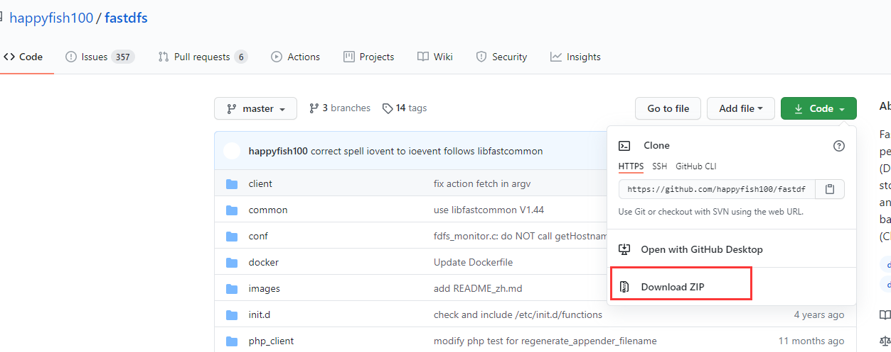
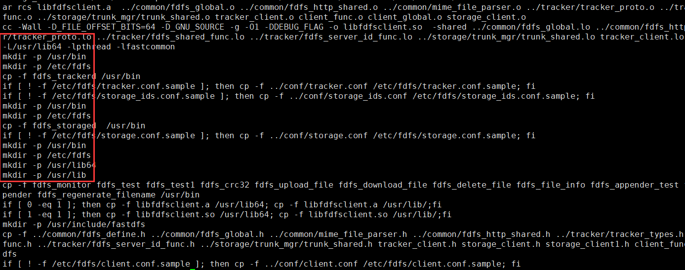

## fastDFS

[TOC]

### 1、前言

### 2、安装

#### 2.1、下载资源

[https://github.com/happyfish100](https://github.com/happyfish100)

下载`zip`文件，然后上传到服务器`/usr/local/lib/fastDFS`中。

`libfastcommon`：从 `fastdfs` 项目和 `fastdht` 项目中提取出来的公共 C 函数库；

`fastdfs`：FastDFS 核心项目；

`fastdfs-nginx-module`：Nginx 整合 FastDFS 时 Nginx 需要添加的模块资源；

#### 2.2、安装 `fastDFS`

> 安装C++环境依赖

~~~shell
yum install -y make cmake gcc gcc-c++
~~~

> 安装 `unzip` 用于解压

~~~shell
yum install -y unzip
~~~

> 解压`libfastcommon`编译并安装

~~~shell
[root@test fastDFS]# unzip libfastcommon.zip
[root@test fastDFS]# cd libfastcommon-master
[root@test libfastcommon-master]# ./make.sh && ./make.sh install
~~~

`libfastcommon` 默认安装在以下位置：

- `/usr/lib64`

- `/usr/include/fastcommon`

- `/usr/lib`：创建软链接

  

> 解压 `fastdfs` 编译并安装

~~~shell
[root@test fastDFS]# unzip fastdfs.zip
[root@test fastDFS]# cd fastdfs-master
[root@test fastdfs-master]# ./make.sh && ./make.sh install
~~~

`fastdfs` 默认安装在以下位置：

- `/usr/bin`：可执行文件
- `/etc/fdfs`：配置文件
- `/etc/init.d`：主程序代码
- `/usr/include/fastdfs`：插件组

#### 2.3、启动 `Tracker`

~~~shell
[root@test /]# cd /etc/fdfs
[root@test fdfs]# ll
总用量 32
-rw-r--r-- 1 root root  1909 10月  9 17:20 client.conf.sample
-rw-r--r-- 1 root root 10246 10月  9 17:20 storage.conf.sample
-rw-r--r-- 1 root root   620 10月  9 17:20 storage_ids.conf.sample
-rw-r--r-- 1 root root  9138 10月  9 17:20 tracker.conf.sample
[root@test fdfs]# cp tracker.conf.sample tracker.conf
总用量 44
-rw-r--r-- 1 root root  1909 10月  9 17:20 client.conf.sample
-rw-r--r-- 1 root root 10246 10月  9 17:20 storage.conf.sample
-rw-r--r-- 1 root root   620 10月  9 17:20 storage_ids.conf.sample
-rw-r--r-- 1 root root  9138 10月  9 17:32 tracker.conf
-rw-r--r-- 1 root root  9138 10月  9 17:20 tracker.conf.sample
~~~

- `client.conf.sample`：客户端的配置文件
- `storage.conf.sample`：存储器的配置文件
- `tracker.conf.sample`：跟踪器的配置文件

> 修改`tracker.conf`
>
> 只修改几项

~~~shell
# 允许访问 tracker 服务器的 IP 地址，为空则表示不受限制
bind_addr =

# tracker 服务监听端口
port = 22122

# tracker 服务器的运行数据和日志的存储父路径（需要提前创建好）
base_path = /home/fastdfs/tracker

# tracker 服务器 HTTP 协议下暴露的端口
http.server_port = 9080
~~~

~~~shell
# 创建 tracker 服务器的运行数据和日志的存储父路径
mkdir -p /home/fastdfs/tracker
# 启动 tracker 服务
service fdfs_trackerd start
# 查看 tracker 服务状态
service fdfs_trackerd status
# 重启 tracker 服务
service fdfs_trackerd restart
# 停止 tracker 服务
service fdfs_trackerd stop
~~~

#### 2.4、启动 `Storage`

~~~shell
[root@test home]# cd /etc/fdfs/
[root@test fdfs]# cp storage.conf.sample storage.conf
[root@test fdfs]# ll
总用量 56
-rw-r--r-- 1 root root  1909 10月  9 17:20 client.conf.sample
-rw-r--r-- 1 root root 10246 10月  9 17:44 storage.conf
-rw-r--r-- 1 root root 10246 10月  9 17:20 storage.conf.sample
-rw-r--r-- 1 root root   620 10月  9 17:20 storage_ids.conf.sample
-rw-r--r-- 1 root root  9139 10月  9 17:37 tracker.conf
-rw-r--r-- 1 root root  9138 10月  9 17:20 tracker.conf.sample
[root@knowledge-test fdfs]# vim storage.conf
~~~
> 修改 storage.conf
~~~~shell
# storage 组名/卷名，默认为 group1
group_name = group1

# 允许访问 storage 服务器的 IP 地址，为空则表示不受限制
bind_addr =

# storage 服务器的运行数据和日志的存储父路径（需要提前创建好）
base_path = /home/fastdfs/storage/base

# storage 服务器中客户端上传的文件的存储父路径（需要提前创建好）
store_path0 = /home/fastdfs/storage/store

# storage 服务器 HTTP 协议下暴露的端口
http.server_port = 8888

# tracker 服务器的 IP 和端口
tracker_server = 127.0.0.1:22122
~~~~

> 启动 `storage` 服务

~~~shell
# 创建 storage 服务器的运行数据和日志的存储父路径
mkdir -p /home/fastdfs/storage/base
# 创建 storage 服务器中客户端上传的文件的存储父路径
mkdir -p /home/fastdfs/storage/store
# 启动 storage 服务
service fdfs_storaged start
# 查看 storage 服务状态
service fdfs_storaged status
# 重启 storage 服务
service fdfs_storaged restart
# 停止 storage 服务
service fdfs_storaged stop
~~~

